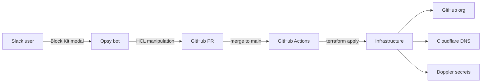

# opsy

Monorepo for `jae-labs` infrastructure-as-code and the Opsy Slack bot that provides self-service GitOps workflows.

## Architecture



## Repository Structure

```
.github/workflows/   # CI pipelines for bot and terraform
bot/slack/           # Opsy Slack bot (Go)
iac/terraform/
  github/            # GitHub org root module
  cloudflare/        # Cloudflare DNS root module
  doppler/           # Doppler secrets root module
  modules/           # Reusable Terraform modules
  docs/              # Terraform documentation
  scripts/           # Bootstrap scripts
```

## Components

**[Opsy Slack Bot](bot/slack/)** — Go bot running in Socket Mode. Handles self-service workflows (repo creation/modification/deletion, DNS records, org settings) via thread-keyed state machine and Block Kit modals. Produces PRs against the IaC in this repo.

**[Terraform IaC](iac/terraform/)** — Three root modules managing the `jae-labs` GitHub org, Cloudflare DNS, and Doppler secrets. Remote state in GCS. Reusable modules under `modules/`.

## CI/CD

All CI runs via GitHub Actions (`.github/workflows/`). Merging to `main` auto-applies Terraform across all three root modules. The bot is built and tested on every PR.

## Prerequisites

- Go 1.25+
- Terraform >= 1.5
- `gcloud` CLI authenticated with GCS state bucket access
- Slack app with Socket Mode enabled and bot token
- GitHub token with org admin scope
- Doppler CLI (optional, for local secret injection)

## Development

**Bot:**

```sh
cd bot/slack
go test ./...
go build ./cmd/opsy/
```

**Terraform:**

```sh
cd iac/terraform/<module>
terraform init
terraform plan
```
