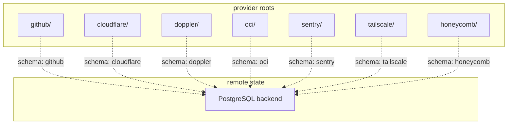

# Repository Architecture

This repo is split by provider/domain into independent Terraform roots. Each top-level provider folder owns its own state schema and is applied independently.

## Topology

## Core model

- one Terraform root per top-level provider folder
- one PostgreSQL backend schema per root
- path-filtered CI/CD applies only the changed root
- no reusable internal Terraform modules; roots stay flat

## References

- [providers.md](providers.md) — generic provider-root model, `locals.tf`
- [ci-cd.md](ci-cd.md) — workflows, triggers, secrets
