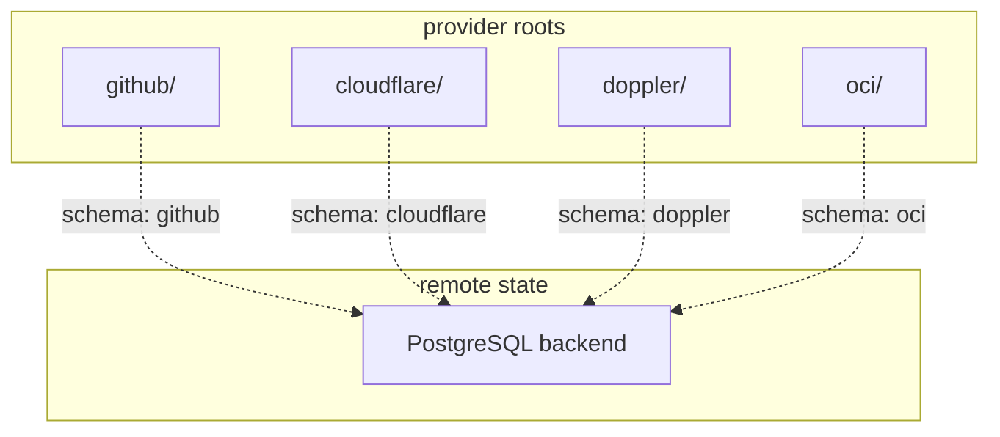
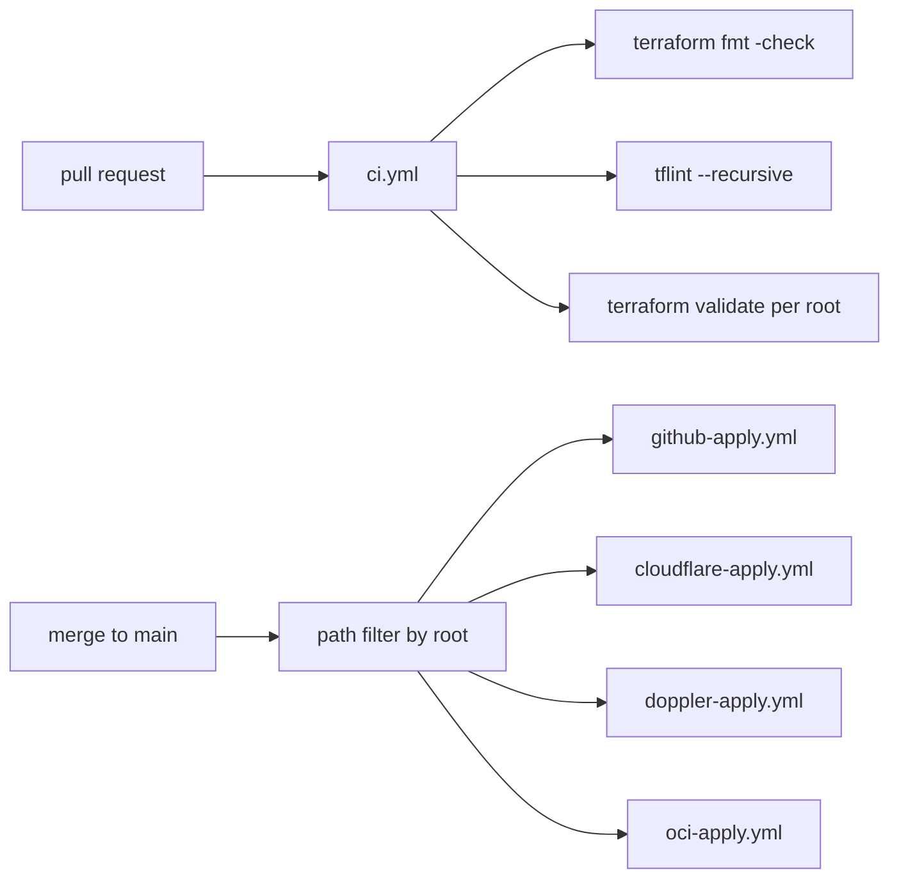

# Repository Architecture

This repo separates infrastructure by provider/domain into independent Terraform roots. The split keeps blast radius small, allows path-filtered CI/CD, and avoids cross-root state coupling.

## Topology

## Layout

| Path | Responsibility |
|---|---|
| `github/` | Flat GitHub org root |
| `cloudflare/` | Flat Cloudflare root |
| `doppler/` | Flat Doppler root |
| `oci/` | Flat OCI root |
| `docs/` | Root and operations documentation |
| `scripts/` | Operational utilities |

## State model

- Backend: PostgreSQL `pg` backend
- Isolation boundary: one backend schema per root
- Cross-root dependencies: none by design
- Apply model: plan and apply only the changed root

This keeps operations idempotent and reduces the chance that an unrelated provider change mutates the wrong state.

## CI/CD flow

Reusable apply logic lives in `.github/workflows/terraform-reusable.yml` for GitHub, Cloudflare, and Doppler. OCI has a dedicated workflow because it needs multiple provider environment variables and stack inputs.

## Bot coupling

The [conCierge bot](https://github.com/jae-labs/conCIerge/tree/main) is an external client of this repository. It reads live Terraform configuration from this repo, uses that data to populate Slack workflows and validate requests, then writes changes back by editing specific Terraform locals files and opening pull requests.

It is a client because it consumes this repo through stable file paths, locals structures, and `concierge-schema.yaml` rather than sharing in-process code or Terraform state with it.

The contract is the set of files and data shapes the bot expects to stay aligned:

| File | Reason |
|---|---|
| `concierge-schema.yaml` | Declares editable resources, form fields, field paths, and key sources |
| `github/locals.tf` | Repository, membership, and org settings backing GitHub schema resources |
| `cloudflare/locals.tf` | DNS CRUD input backing the Cloudflare DNS schema resource |
| `doppler/locals.tf` | Project CRUD input backing the Doppler project schema resource |

Constraints:

- do not rename or move schema-managed files without updating `concierge-schema.yaml`
- do not change key names, nesting, or field paths without updating `concierge-schema.yaml`
- treat `concierge-schema.yaml` and schema-managed locals as bot-consumed API surfaces, not internal-only config

Break the contract and the likely failure mode is not Terraform itself. The likely failure is that Slack request handling, validation, or PR generation in the bot stops working correctly.

See the root docs for exact shapes and examples.
